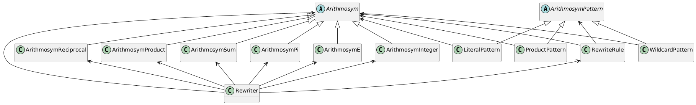

# Arithmosym

Think `Arithmonym`'s precision problems outweigh its cost? `Arithmosym` to the rescue. Did you spot the difference? Yes. A one letter difference makes a big difference. Zero precision loss-- yes, zero. Speed? Not necessarily, but in some cases, speed isn't so importnat.

---

(i) PLEASE NOTE THAT THIS FEATURE IS STILL EXPERIMENTAL! ALL FEATURES ARE NOT TESTED YET.

---

## Usage

```csharp
using System;
using GoogolSharp;
using GoogolSharp.Experimental;

Arithmosym myArithmosym = Arithmosym.Parse("5+7*(pi-1)");

Console.WriteLine($"My Arithmosym: {myArithmosym}"); // -2+(7*π)
```

---

## UML Diagram

